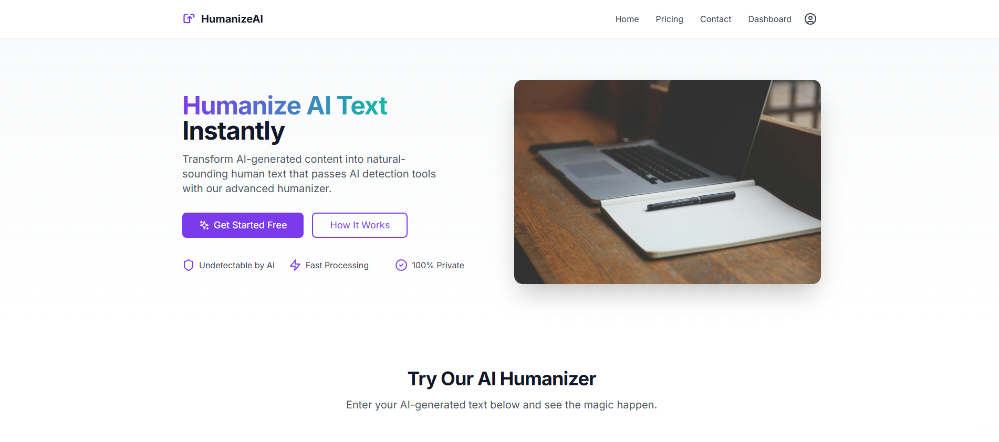
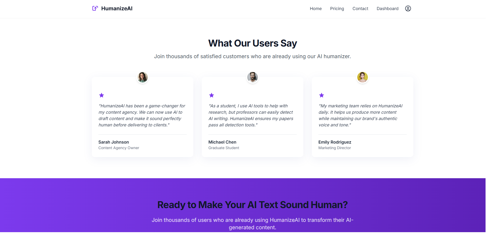
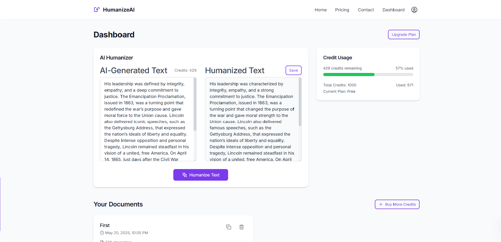

# AI Humanizer Pro 🚀✨

[](https://reactjs.org/) [](https://vitejs.dev/) [](https://www.typescriptlang.org/) [](https://tailwindcss.com/) [](https://supabase.io/)

**Transform AI-generated text into authentic, human-like content with ease!** AI Humanizer Pro is a powerful tool designed to refine and polish text, making it indistinguishable from content written by a human. Perfect for writers, marketers, students, and anyone looking to elevate their AI-assisted content.

---

**Live Demo:** [https://splendorous-shortbread-b6cb98.netlify.app/](https://splendorous-shortbread-b6cb98.netlify.app/) 👈 (Replace with your actual link)

**Screenshots/GIFs:**
(Consider adding a GIF of the humanization process or screenshots of the dashboard)









##🌟 Key Features

* **🤖 Advanced AI Humanization**: Input AI-generated text and receive natural, engaging, and human-sounding output.
* **👤 User Authentication**: Secure sign-up and login functionality.
* **💳 Credit System**: Users get credits based on their plan to use the humanization service.
* **💾 Document Management**: Save, view, and manage your humanized documents directly within the app.
* **📋 Copy to Clipboard**: Easily copy the humanized text for use anywhere.
* **✨ Sleek & Responsive UI**: Modern user interface built with React, Tailwind CSS, and Framer Motion for a smooth experience on all devices.
* **📊 Credit Usage Tracking**: Users can monitor their remaining credits and current plan.
* **⚡ Fast & Efficient**: Powered by Vite for a lightning-fast development experience and optimized builds.

## 🛠️ Tech Stack

* **Frontend**:
  * [React](https://reactjs.org/) (v18.3)
  * [Vite](https://vitejs.dev/) (v5.4)
  * [TypeScript](https://www.typescriptlang.org/) (v5.5)
  * [React Router DOM](https://reactrouter.com/) (v6.20) for client-side routing
  * [Zustand](https://github.com/pmndrs/zustand) (v4.4) for state management
  * [Tailwind CSS](https://tailwindcss.com/) (v3.4) for styling
  * [Framer Motion](https://www.framer.com/motion/) for animations
  * [Lucide React](https://lucide.dev/) for icons
* **Backend/Database**:
  * [Supabase](https://supabase.io/) (v2.23) for authentication, database, and potentially other backend services.
* **Linting & Formatting**:
  * [ESLint](https://eslint.org/) with `@typescript-eslint/parser`
  * (You might also be using Prettier - add if so)

## 🚀 Getting Started

Follow these instructions to set up and run the project locally.

### Prerequisites

* [Node.js](https://nodejs.org/) (v18.x or higher recommended)
* [npm](https://www.npmjs.com/) (usually comes with Node.js)
* A Supabase account and project. You'll need your Supabase URL and Anon Key.

### Installation

1. **Clone the repository:**

   ```bash
   git clone https://your-repository-url/ai-humanizer-app.git 
   cd ai-humanizer-app
   ```
2. **Install dependencies:**

   ```bash
   npm install
   ```

### Configuration

1. **Set up environment variables:**
   Create a `.env` file in the root of your project and add your Supabase credentials:

   ```env
   VITE_SUPABASE_URL=your_supabase_url
   VITE_SUPABASE_ANON_KEY=your_supabase_anon_key
   ```

   *Replace `your_supabase_url` and `your_supabase_anon_key` with your actual Supabase project URL and Anon Key.*
2. **Supabase Setup:**

   * Ensure you have the necessary tables set up in your Supabase database (e.g., `profiles` for user data including credits and plan type, `humanized_texts` for saved documents).
   * Configure Row Level Security (RLS) policies on your Supabase tables appropriately to protect user data.

### Running the Development Server

Once you've installed dependencies and configured your environment variables, you can start the development server:

```bash
npm run dev
```

This will start the Vite development server, typically on `http://localhost:5173` (or `http://your-ec2-ip:5173` if `--host` is used). The server will automatically reload when you make changes to the code.

## 📜 Available Scripts

In the project directory, you can run the following scripts:

* `npm run dev`: Starts the development server with Vite.
* `npm run build`: Builds the app for production to the `dist` folder.
* `npm run lint`: Lints the codebase using ESLint.
* `npm run preview`: Serves the production build locally to preview it.

## 📁 Project Structure (Simplified)

```
ai-humanizer-app/
├── public/ # Static assets (e.g., favicon)
├── src/
│ ├── assets/ # Images, fonts, etc.
│ ├── components/ # Reusable UI components
│ │ ├── dashboard/
│ │ ├── humanizer/
│ │ ├── layout/
│ │ └── ui/ # Generic UI elements (Button, Textarea)
│ ├── lib/ # Core logic, hooks, stores, utils
│ │ ├── hooks/ # Custom React hooks
│ │ ├── store/ # Zustand stores (humanizerStore, profileStore)
│ │ └── utils/ # Utility functions
│ ├── pages/ # Page components (DashboardPage, LoginPage, etc.)
│ ├── App.tsx # Main application component with routing
│ ├── main.tsx # Entry point of the application
│ └── index.css # Global styles (often Tailwind base/components/utilities)
├── .env # Environment variables (ignored by Git)
├── .eslintrc.cjs # ESLint configuration
├── .gitignore # Files and folders to ignore for Git
├── index.html # Main HTML entry point
├── package.json # Project metadata and dependencies
├── postcss.config.js # PostCSS configuration (for Tailwind)
├── tailwind.config.js # Tailwind CSS configuration
├── tsconfig.json # TypeScript base configuration
├── tsconfig.node.json # TypeScript configuration for Node.js environment (e.g. Vite config)
└── vite.config.ts # Vite configuration
```

## 🤝 Contributing

Contributions are welcome! If you'd like to contribute, please follow these steps:

1. Fork the repository.
2. Create a new branch (`git checkout -b feature/your-feature-name`).
3. Make your changes.
4. Commit your changes (`git commit -m 'Add some amazing feature'`).
5. Push to the branch (`git push origin feature/your-feature-name`).
6. Open a Pull Request.

Please make sure to update tests as appropriate.

## 📄 License

This project is licensed under the MIT License - see the [LICENSE.md](LICENSE.md) file for details.
*(If you don't have a LICENSE.md, you should create one. MIT is a common choice for open-source projects.)*

---

Made with ❤️ by [Your Name/Your Team]

*(Replace [Your Name/Your Team] with your actual name or team name)*
